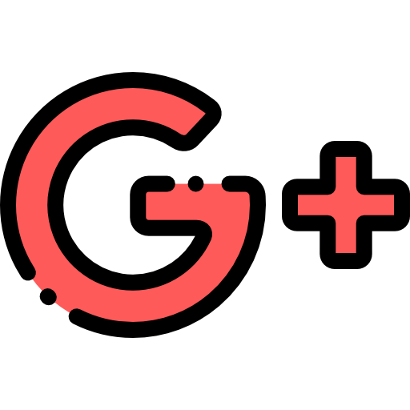

 

!;I'm+Debamrita" />
<h3 align="center">A passionate Machine Learning, Deep Learning student and Frontend Developer from India</h3>

<a href="https://www.instagram.com/im_debamrita">  &nbsp;
<a href="https://twitter.com/DebamritaP">  &nbsp;
<a href="mailto:imdebamrita@gmail.com">  &nbsp;
<a href="https://t.me/im_debamrita">  &nbsp;
<a href="https://discord.gg/im_debamrita">  &nbsp;
<a href="https://www.linkedin.com/in/imdebamritapaul">  &nbsp;

<!---<a href="https://dev.to/imdebamrita">  &nbsp;
<a href="https://www.buymeacoffee.com/imdebamrita">  &nbsp;--->

</a>

    
### 🚀 **Tools I Use**  

#### 🖥️ **Programming Languages**:

#### 🌐 **Frontend Development**: 

#### 🧠 **Machine Learning & AI**: 

#### 🛠 **Backend & Databases**: 

#### ⚙️ **Version Control & DevOps**: 

---

    

 

    

 <strong> More stats </strong> 

<a href="https://github.com/imdebamrita">

    

<!---
    

    
&nbsp;

    

    
&nbsp;

     --->

